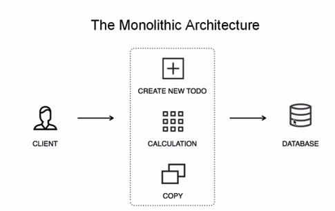

# MSA

# Monolith vs Microservice Architecture

## Monolith

- 모든 업무 로직이 하나의 애플리케이션 형태로 패키지되어 서비스
- 애플리케이션에서 사용하는 데이터가 한 곳에 모여 참조되어 서비스되는 형태



## Microservice Architecture

- 비즈니스 로직의 서비스들이 분리되어 존재
- 독립적으로 배포 가능
- CI/CD가 중요!!

## MSA 표준 구성요소


## Service Mesh Capabilities


- MSA 인프라 → 미들웨어
    - 프록시 역할, 인증, 권한 부여, 암호화, 서비스 검색, 요청 라우팅, 로드 밸런싱
    - 자가 치유 복구 서비스
- 서비스간의 통신과 관련된 기능을 자동화

## MSA 표준 구성요소

- CNCF (Cloud Native Computing Foundation)
    - Cloud Native Interactive Landscape

## Spring Cloud

- 환경 설정을 위해 `Spring Cloud Config Server` 필요
    - 외부 저장소에 한번에 환경설정 모아둠
    - 유지보수가 쉬워진다.
- 서비스 등록과 위치 정보 확인을 위해 `Naming Server (Eureka)`
- Load Distribution (Load balancing) 을 위해 `Ribbon (Client Side)`, `Spring Cloud Gateway` 사용
    - 외부의 클라이언트나 서비스 정보가 게이트웨이를 통과해서 Micro Service로 이동
- 각각의 Micro Service 간의 통신을 위해 `FeignCliend` 이용
- 시각화나 모니터링 서비스를 위해 `Zipkin Distributed Tracing`, `Netflix API gateway` 이용
    - 로그 확인 등
- 장애 발생했을 때 회복성 패턴을 위해 `Hystrix` 이용

---

# Service Discovery

- 외부에서 다른 서비스들이 다른 micro service를 검색하기 위해 사용하는 개념
    - 일종의 전화번호부 책
    - key와 value가 저장되어 있음
    - 어떤 서비스가 어디 위치에 있는지 알 수 있음
    - 등록, 검색의 기능 제공

⇒ `Spring Cloud Netflix Eureka` 사용해서 구현

1. 클라이언트가 자신이 이용하고 싶은 서비스에 대한 요청 정보를 Load Balancer, Gateway API에게 전달
2. 그 요청 정보가 Service Discovery에 전달되어 내가 필요한 정보가 어디 있냐 물어봄
3. 그 서비스는 몇번 서버로 가세요~ 를 반환한다.
4. 그럼 다시 Load Balancer가 알맞는 서버에 요청값 전송, 반환값 받는다.

```yaml
server:
  port: 8761

spring:
  application:
    name: discoveryservice

eureka:
  client:
    register-with-eureka: false
    fetch-registry: false
```

- register-with-eureka: 자신의 정보를 자신에게 등록하는 작업.. 의미 없기 때문에 false로.. 그냥 서버로만 기동되면 됨
- fetch-registry: 이 클라이언트가 다른 서비스의 endpoints에 대한 정보를 다운로드하기 위해 유레카 서버에 연결을 시도할지 여부
    - 유레카에 등록되는 서비스들의 정보를 갱신하기 위한 용도!

[https://github.com/spring-cloud/spring-cloud-release/wiki/Supported-Versions](https://github.com/spring-cloud/spring-cloud-release/wiki/Supported-Versions)

Spring boot와 Eureka 버전 맞추기!

---

# Service Discovery

### Eureka 서버

- ecommerce 프로젝트 - EcommerceApplication.java

```java
@SpringBootApplication
@EnableEurekaServer
public class EcommerceApplication {

    public static void main(String[] args) {
        SpringApplication.run(EcommerceApplication.class, args);
    }

}
```

### user-service

- user-service 프로젝트 - UserServiceApplcation.java

```java
@SpringBootApplication
@EnableDiscoveryClient
public class UserServiceApplication {

	public static void main(String[] args) {
		SpringApplication.run(UserServiceApplication.class, args);
	}

}
```

## user-service 프로젝트를 Eureka에 등록

- user-service 프로젝트

```yaml
server:
  port: 9001
spring:
  application:
    name: user-service
eureka:
  client:
    register-with-eureka: true
    fetch-registry: true
    service-url:
      defaultZone: http://127.0.0.1:8761/eureka
```


### user-service 프로젝트의 run - edit configurations


- -D : 옵션 추가하겠다


-D : 옵션 추가하겠다


또는, 터미널에서

```java
./gradlew bootRun --args='--server.port=9003'

```

[maven이 아니라 gradle로 진행중이신 분들 - 인프런 | 질문 & 답변](https://www.inflearn.com/questions/478707/maven이-아니라-gradle로-진행중이신-분들)


user-service 3개가 실행 중!!!

### 하나 더…


```java
./gradlew clean build
./gradlew build
./gradlew bootRun --args='--server.port=9004'
```


### user-service 4개 실행 중!!

---

근데 이렇게 계속 포트 바꿔주는 거 귀찮음..

```java
server:
  port: 0
spring:
  application:
    name: user-service
eureka:
  client:
    register-with-eureka: true
    fetch-registry: true
    service-url:
      defaultZone: http://127.0.0.1:8761/eureka
```

port: 0번 → 랜덤으로

이렇게 하면 몇개를 실행해서 죄다 랜덤포트가 부여돼서 실행되더라도 0번 포트밖에 안뜸 (유레카에)

```java
server:
  port: 0
spring:
  application:
    name: user-service
eureka:
  instance:
    instance-id: ${spring.cloud.client.hostname}:${spring.application.instance_id:${random.value}}
  client:
    register-with-eureka: true
    fetch-registry: true
    service-url:
      defaultZone: http://127.0.0.1:8761/eureka
```


저렇게 yml 수정해주면 인스턴스 아이디 추가돼서 분리돼서 나옴!!

scaling 작업 해주기 위해 여러 인스턴스 만들고 각각의 인스턴스 서비스는 유레카에 잘 등록됨!

로드 밸런스!!!

---

# API Gateway Service

사용자가 설정한 라우팅 설정에 따라 각각 엔드포인트로 클라이언트를 대신해 요청하고 응답을 받으면 다시 클라이언트에게 전달해주는 프록시 역할을 함

시스템 내부 구조는 숨기고 외부에 요청에 대해 적절히 가공해 응답할 수 있는 장점이 있다.


MS가 독립적으로 빌드가 되고 배포가 될 수 있는 장점.

하지만 Client side에서는…

클라이언트 사이드에서 마이크로서비스의 주소를 직접 이용해서, 이걸 엔드포인트. 엔드포인트를 직접 호출 했을 경우 client side에 있는 어플리케이션도 같이 수정 배포가 되어야함

이러다 보니 단일 진입점을 가지고 있는 형태로써 개발하는 게 필요.

서버단(백엔드)에 중간에 게이트웨이 역할을 해줄수잇는 일종의 진입로, 게이트웨이를 두고 각각의 ms에 요청되는 모든 정보에 대해 얘가 일괄적으로 처리

모바일앱도 상관없음.


직접적으로 ms를 호출하지 않고 클라이언트는 게이트웨이만 상대함.

따라서 게이트웨이에서 필요로 하는 정보를 변경하고 갱신하는 작업이 수월하당.

### 단일 진입점에서 처리(게이트웨이 역할)

- 인증 및 권한 부여
- 마이크로서비스 검색 통합
- 응답 캐싱
- 정책, 회로 차단기 및 QoS 다시 시도
- 속도 제한
- 부하 분산
    - ms가 가지고 잇는 하나의 서비스의 내용을 세개의 인스턴스가 나눠서 작업했다고 가정
    - ms1, ms2, ms3
    - 그럼 어디로 요청 보낼지 판단
- 로깅(각각의 ms가 하나의 solution을 이용해 로그를 모아놓을수도있음. 물론 로그만 전문적으로 처리해줄수 잇는 시스템 (ex. ELK)써서 처리할 수도 있다.)
- 추적(어떤 ms가 누구에 의해 호출, 진입점이 누구, 어디로 이동 등등 - 추적 관계 중요함!!)
- 상관 관계
- 헤더, 쿼리 문자열 및 청구 변환
- IP 허용 목록에 추가
    - 방화벽, 프록시 역할 해주는 게이트웨이!

## Netflix Ribbon

- Spring Cloud에서의 MSA간 통신
    1. RestTemplate
        - 하나의 웹 어플리케이션에서 다른 어플리케이션을 사용하기 위해 자주 사용되었던 API

        

    2. Feign Client
        - 추가적으로 호출하고 싶은 서비스 `@FeignClient`로 등록
            - 직접적인 서버 주소, 포트 번호 없이 ms이름 가지고 호출 가능

        

        - user라는 서비스 안에 stores라는 서비스가 자신이 가지고 있는 API 처럼 자유롭게 호출해서 사용 가능

- Ribbon: Client side Load Balancer
    - 초창기에는 로드 밸런스를 해주기 위해 리본이라는 서비스 제공함
    - 문제: 리본이라는 서비스 자체는 최근에 Functional API(react java) - 비동기 처리가 잘 안되기 때문에 최근에 잘 사용x
    - 서비스 이름으로 호출
        - 클라이언트 안에서 필요한 데이터 호출
    - Health Check
        - 해당 서비스 잘 작동 중인지 확인
    - service 3개 있다고 가정
        - 클라이언트 내부에 ribbon을 두고 (이때는 api gateway 사용x) 이걸로 이동하고자하는 ms서비스의 주소값 관리
        - Client Side에서!!!!!
        - 장점: 외부에 있는 마이크로 서비스를 호출하기 위해 ip와 포트번호를 명시하는 게 아니라, ms의 이름만 가지고 호출할 수 있음
    - 최근에는 사용X


## Netflix Zuul 구현


- 구성
    - 테스트
        - First Service
        - Second Service
            - Spring Boot: 2.3.8
    - Netflix Zuul → Gateway
        - 역할
            - Routing
            - API gateway
- 얘도 더 이상 사용 X

### Spring Cloud - Spring Boot 버전 맞추기

[Spring Cloud](https://spring.io/projects/spring-cloud)

```java
server:
  port: 8000
spring:
  application:
    name: my-zuul-service
zuul:
  routes:
    first-service:
      path: /first-service/**
      url: http://localhost:8081
    second-service:
      path: /second-service/**
      url: http://localhost:8082
```

zuul이라는 서비스가 8000으로 `first-service/**`라는 요청이 들어오면

8081로 포워딩 시킨다.

`http://localhost:8000/first-service/welcome`

---

## Spring Cloud Gateway - 기본

```yaml
server:
  port: 8000
eureka:
  client:
    register-with-eureka: false
    fetch-registry: false
    service-url:
      defaultZone: http://localhost:8761/eureka

spring:
  application:
    name: gateway-service
  cloud:
    gateway:
      routes:
        - id: first-service
          uri: http://localhost:8081/
          predicates:
            - Path=/first-service/**
        - id: second-service
          uri: http://localhost:8082/
          predicates:
            - Path=/second-service/**
```

- Zuul과는 다르게 Controller에 맵핑을 해줘야 한다.
    - `http://localhost:8081/first-service/**` 이렇게 가기 때문이다.


- Zuul 대신 Spring Cloud Gateway 써보자.
    - `predicates`: 조건
        - first-service라는 요청 들어오면 8081로 가겠다.

### Zuul vs Spring Cloud Gateway

- Spring Cloud Gateway: 비동기 처리 제공

## Spring Cloud Gateway - Filter


- .yml 부분대신 [FilterConfig.java](http://FilterConfig.java) 사용해보기

```yaml
server:
  port: 8000
eureka:
  client:
    register-with-eureka: false
    fetch-registry: false
    service-url:
      defaultZone: http://localhost:8761/eureka

spring:
  application:
    name: gateway-service
#  cloud:
#    gateway:
#      routes:
#        - id: first-service
#          uri: http://localhost:8081/
#          predicates:
#            - Path=/first-service/**
#        - id: second-service
#          uri: http://localhost:8082/
#          predicates:
#            - Path=/second-service/**
```

- FilterConfig.java

```java
public RouteLocator gateWayRoutes(RouteLocatorBuilder builder) {
        return builder.routes()
                .route(r -> r.path("/first-service/**") //이 요청 들어오면
                        .filters(f-> f.addRequestHeader("first-request", "first-request-header")
                                .addResponseHeader("first-response", "first-response-header"))
                        .uri("http://localhost:8081/")) //여기로 이동하겠다
                .route(r -> r.path("/second-service/**")
                        .filters(f-> f.addRequestHeader("second-request", "second-request-header")
                                .addResponseHeader("second-response", "second-response-header"))
                        .uri("http://localhost:8082/"))
                .build();
    }
```


---

### 다른 방법

- 필터를 yml에서 넣기

```java
server:
  port: 8000
eureka:
  client:
    register-with-eureka: false
    fetch-registry: false
    service-url:
      defaultZone: http://localhost:8761/eureka

spring:
  application:
    name: gateway-service
  cloud:
    gateway:
      routes:
        - id: first-service
          uri: http://localhost:8081/
          predicates:
            - Path=/first-service/**
          filters:
            - AddRequestHeader=first-request, first-request-header2
            - AddResponseHeader=first-response, first-response-header2
        - id: second-service
          uri: http://localhost:8082/
          predicates:
            - Path=/second-service/**
          filters:
            - AddRequestHeader=second-request, second-request-header2
            - AddResponseHeader=second-response, second-response-header2
```

- [FilterConfig.java](http://FilterConfig.java) 파일에 어노테이션 다 주석 걸어줌 안쓸려고


- .yml에 추가한 key-value response 잘 확인된당!!

---

### Custom Filter 만들

```bash
@Component
@Slf4j
public class CustomFilter extends AbstractGatewayFilterFactory<CustomFilter.Config> { //우리가 지금 만들고 있는 CustomFilter의 Config
    public CustomFilter() {
        super(Config.class);
    }

    @Override
    public GatewayFilter apply(Config config) { //우리가 적용하고 싶은 내용
        // Custom Pre Filter
        return (exchange, chain) -> {
            ServerHttpRequest request = exchange.getRequest(); //exchage로부터 request 받아오기
            ServerHttpResponse response = exchange.getResponse(); //response 받아오기

            log.info("Custom PRE filter: request id -> {}", request.getId());

            // Custom Post Filter - 처리 후
            return chain.filter(exchange).then(Mono.fromRunnable(() -> { //chain에 연결 -> 필터 추가
                // Mono : 데이터 타입 하나 줄 거임
                // 비동기 방식에서 단일값일 때 사용, response 할 때 response status code를 출력
                log.info("Custom POST filter: response code -> {}", response.getStatusCode());
            }));
        };
    }

    public static class Config {
        // Put the configuration properties
    }
}
```


- CustomFilter 등록


### GlobalFilter

- 현재 first-service, second-service에 동일한 `CustomFilter` 적용 중.
- 이렇게 라우팅 정보마다 등록하지말고
- 공통적인 필터 있으면 한번에 등록하자
- 전체 라우터에 적용!
    - 가장 먼저 실행되고 가장 나중에 종료됨.

```yaml
.
.
.
spring:
  application:
    name: gateway-service
  cloud:
    gateway:
      default-filters:
        - name: GlobalFilter
          args:
            baseMessage: Spring Cloud Gateway GlobalFilter
            preLogger: true
            postLogger: true
      routes:
        - id: first-service
          uri: http://localhost:8081/
          predicates:
            - Path=/first-service/**
          filters:
#            - AddRequestHeader=first-request, first-request-header2
#            - AddResponseHeader=first-response, first-response-header2
            - CustomFilter
      .
			.
			.
```


- 근데 저렇게 yml에 값을 직접 타이핑 하면 귀찮다.
    - 추후애…


### LoggingFilter

- 일종의 커스텀 필터


---

## Spring Cloud Gateway - Eureka 연동

### Load Balancer


## 서버 → 게이트웨이 → my-first-service, my-second-service로 연결!!

### 1. 서버 (DiscoveryService)

```java
@SpringBootApplication
@EnableEurekaServer
public class DiscoveryServiceApplication {

    public static void main(String[] args) {
        SpringApplication.run(DiscoveryServiceApplication.class, args);
    }

}
```

- `@EnableEurekaServer` 추가!! - 서버로 등록

### 2. 게이트웨이(gateway-service)

```java
@SpringBootApplication
@EnableEurekaClient
public class GatewayServiceApplication {

    public static void main(String[] args) {
        SpringApplication.run(GatewayServiceApplication.class, args);
    }

}
```

- `@EnableEurekaClient` 추가!! - 클라이언트로 등록

```yaml
server:
  port: 8000
eureka:
  client:
    register-with-eureka: true
    fetch-registry: true
    service-url:
      defaultZone: http://localhost:8761/eureka
```

- `register-with-eureka: true` → 유레카에 등록

### 3. 서버들… (my-first-service, my-second-service)

- 위에 게이트웨이랑 똑같이 유레카 클라이언트로 등록해줌


여기 중…


이 이름!!!!

이제 uri 안 쓰고 저 Application 이름으로 로드밸런싱할 것임

```yaml
routes:
        - id: first-service
          uri: lb://MY-FIRST-SERVICE
          predicates:
            - Path=/first-service/**
          filters:
            - CustomFilter
        - id: second-service
          uri: lb://MY-FIRST-SERVICE
          predicates:
            - Path=/second-service/**
```

- uri 바꿔주기
    - `uri: lb://MY-FIRST-SERVICE`
    - `uri: lb://MY-FIRST-SERVICE`


만약 이 상태라면…

게이트웨이에서 `uri: lb://MY-FIRST-SERVICE` 이 요청을 받았을 때 `8081` 또는 `9091` 이 중 아무 곳이나 갈 것이다.

### ⇒ 그럼 어디로 요청 갔는 지 알 수 있는 방법!!

```yaml
server:
  port: 0
spring:
  application:
    name: my-first-service

eureka:
  client:
    register-with-eureka: true
    fetch-registry: true
    service-url:
      defaultZone: http://localhost:8761/eureka
  instance:
    instance-id: ${spring.application.name}:${spring.application.instance_id:${random.value}}
```

- 포트번호: 0
    - 랜덤 포트번호 부여 위해
- 인스턴스 추가

```java
@GetMapping("/check")
    public String check(HttpServletRequest request) {
        log.info("Server port={}", request.getServerPort());
        return String.format("Hi, there. This is a mesasge from First Service on PORT %s", env.getProperty("local.server.port"));
    }
```

1. `request.getServerPort()`
2. `env.getProperty("local.server.port")`


- round-robin 방식으로 번갈아가면서 호출해준당.